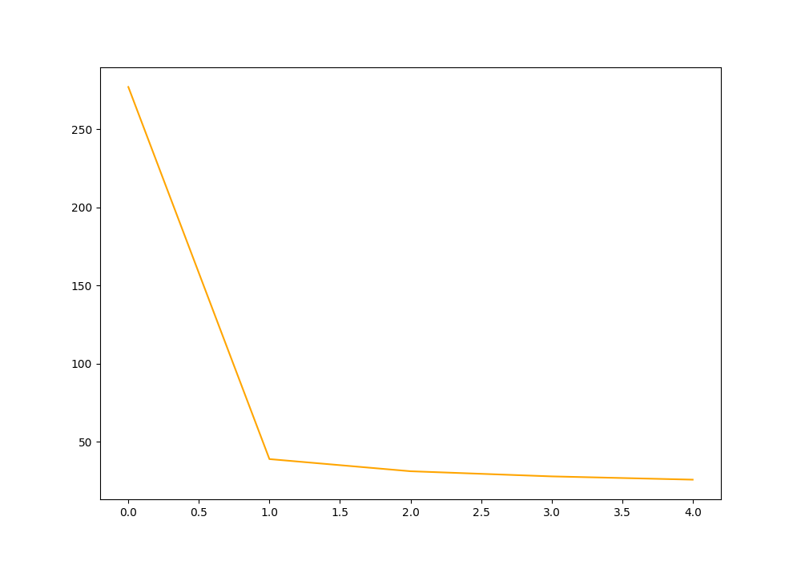

## Implementation of [UNet](https://arxiv.org/abs/1505.04597) in PyTorch

<div align="center">


</div>

### Dataset

[Carvana](https://www.kaggle.com/competitions/carvana-image-masking-challenge/data) dataset is used to train and test
the model.
To download the dataset run the `download.sh` file.

### Train
```commandline
python train.py
```
Epoch Loss Graph after 5 epochs (Not mean, sum):
<div align="center">

</div>

### Inference
```commandline
python inference.py --input [input_image_path] --output [output_image_path]
```