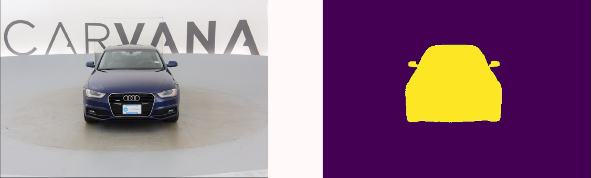

# [UNet](https://arxiv.org/abs/1505.04597) Implementation using PyTorch

<div align="center">

</div>

## Getting Started

```
git clone git@github.com:yakhyo/UNet-pt.git
cd unet-pytorch
```

- Dice loss and Cross Entropy loss used for training. See the [dice loss](unet/utils/loss.py) implementation.
- `dice_score = 1 - dice_loss` used for evaluation.
- Model weight provided in `weights` folder

### Dataset

[Carvana](https://www.kaggle.com/competitions/carvana-image-masking-challenge/data) dataset is used to train and test
the model.

```
bash tools/download.sh
```

Or simply download the `train_hq.zip` and `train_masks.zip` and extract those folders as shown below:

```
├── data 
    ├── images
         ├── xxx.jpg
         ├── xxy.jpg
         ├── xxz.jpg
          ....
    ├── masks
         ├── xxx_mask.gif
         ├── xxy_mask.gif
         ├── xxz_mask.gif
```

**Note:** Please download `kaggle.json` file first from associated kaggle account then save it under
the `/home/username/.kaggle/kaggle.json` (ubuntu)

### Train

Training arguments

```
python -m tools.main -h
    usage: main.py [-h] [--image_size IMAGE_SIZE] [--save-dir SAVE_DIR] [--epochs EPOCHS] [--batch-size BATCH_SIZE] [--lr LR] [--weights WEIGHTS] [--amp] [--num-classes NUM_CLASSES]
```

Train the model

```commandline
python -m tools.main
```

### Inference

Inference arguments

```
python inference.py -h
    usage: inference.py [-h] [--weights WEIGHTS] [--input INPUT] [--output OUTPUT] [--view] [--no-save] [--conf-thresh CONF_THRESH]
```

Inference an image

```
python -m tools.inference --weights weights/last.pt --input assets/image.jpg --output result.jpg
```
